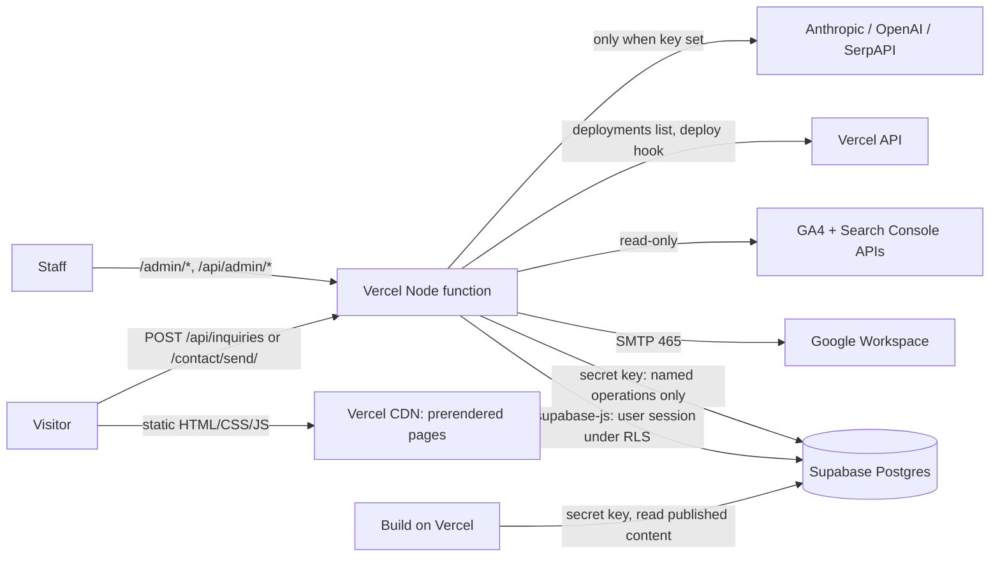
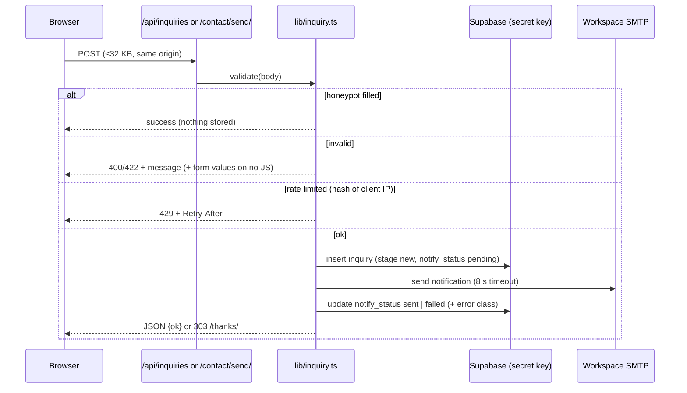
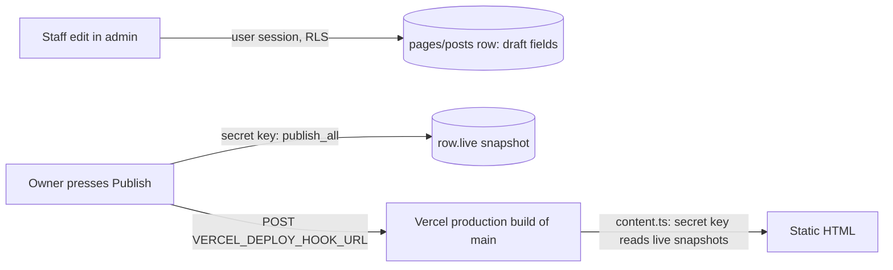

# Design — Finish and launch the ZINC Digital website

Spec `create-a-complete-implementation-spec` · Phase 2 (design) · 4 October 2026 (CT) · Implements requirements.md R1–R18

## 1. Overview

One Astro 7.3.5 project on Vercel (Node 24), using `output: 'static'` with per-route `prerender = false`.

- **Public pages** are prerendered HTML.
- **Admin pages, staff APIs, the contact submit routes and the 410/404 handler** render on demand as one Vercel Node function.
- **Supabase** provides Auth (invite-only magic links) and Postgres (inquiries, staff, content overrides, research).
- **Email** is sent with Nodemailer through Google Workspace SMTP.
- No UI framework, no Docker, no Cloudflare, and no paid service unless the owner sets its key.



**Verified facts this design relies on** (installed Astro 7.3.5 and @astrojs/vercel 11.0.11, read from `zinc-digital-web-worktrees/phase-01/node_modules`):
- Prerendered dynamic routes take precedence over on-demand routes with the same pattern.
- `security.checkOrigin` defaults to `true`.
- `security.csp` is available.
- The Vercel adapter has no `astro preview` support.

**Supabase SSR guidance used** (Supabase docs via Context7): email links point to a server route that calls `verifyOtp({ token_hash, type })`, with cookies managed by `createServerClient` from `@supabase/ssr`.

---

## 2. Milestones and branches

D5 applies: the native Kiro flow. Every milestone runs in this spec's Kiro worktree (`/Volumes/Satechi Hub/zinc-digital-web-wt-create-a-complete-implementation-spec`) on its Kiro branch `spec/create-a-complete-implementation-spec`. Milestones are the numbered task groups in `tasks.md`, executed in order after Spec Builder's hand-off. Each milestone reaches `main` through its own PR.

| Milestone | Scope (requirements) |
|---|---|
| M1 Authority | The spec plus the instruction and `.planning/` reconciliation (R1.1–R1.4). PR #6 is closed after merge. |
| M2 Public site | Port integration, build and CI, every public page fix, assets, SEO head, demo-mode form, static and browser checks, Lighthouse run, visual rounds (R1.5–R1.9, R2, R3, R4, R5 UI, R14.1–R14.2, R15.1–R15.2, R16, R17.1–R17.2, R17.6) |
| M3 Data, auth, contact | Database baseline and migrations, Auth config, sign-in/out, access control, live contact path, email, contact and permission tests (R5–R9, R15.3–R15.5, R17.3–R17.4) |
| M4 Admin | Admin shell, Inquiries, Staff, Pages/Posts/SEO and Publish, Dashboard/Stats/Backend, admin visual rounds (R10–R12) |
| M5 Research | Projects, sources, safe URL fetch, files, SERP, chat, research visual rounds (R13, R17.5) |
| M6 Launch | Redirect/410 map, analytics, `llms.txt`, indexing headers, release-candidate Lighthouse, final visual round, retirement list, launch checklist (R14.3–R14.7, R17.7, R18) |

**Branch rules:**
- **Pushes:** they always name the branch explicitly: `git push origin spec/create-a-complete-implementation-spec`. This branch tracks `origin/main`.
- **End of each milestone:** open a PR from the Kiro branch to `main` and request one Codex review on its final head. It merges by squash once checks pass.
- **Reset after the merge,** before the next milestone starts:
  1. `git fetch origin`;
  2. confirm the merged `main` contains everything on the branch: `git diff origin/main spec/create-a-complete-implementation-spec` is empty;
  3. `git reset --hard origin/main` on the Kiro branch.

  The next milestone's first push recreates the remote branch if GitHub deleted it at merge. If the remote branch still exists, that push uses `--force-with-lease`, which a feature branch allows.
- **After the last milestone merges,** the Kiro branch and worktree are removed.

**Live preview (R18.2):**
- From M2 on, `astro dev --host 127.0.0.1 --port 4321` runs in the background in the active worktree and opens in the dashboard Browser panel.
- After each push, the PR's Vercel preview link (posted by the Vercel GitHub integration) is shared in chat.

---

## 3. Repository layout after integration

New or changed paths only. Existing retained files are listed in PORT.md section 5.3.

```
astro.config.mjs            site, trailingSlash 'always', vercel({ maxDuration: 60 }), fonts + font guard,
                            security { checkOrigin: true, csp: true }, redirects from src/data/redirects.ts
vercel.json                 security headers; noindex header for *.vercel.app hosts
.nvmrc                      24
supabase/config.toml        project_id; [api] schemas; [auth] signup off, site_url, redirect URLs,
                            email templates, SMTP via env()
supabase/migrations/        0001_baseline.sql (pg_dump), 0002_site_fixes.sql, 0003_admin.sql, 0004_research.sql
supabase/templates/         invite.html, magic_link.html (links to /admin/auth/confirm/)
supabase/tests/             *.sql permission tests (rolled back)
src/data/site.ts            routes, services, cases, copy (port, corrected toward Design)
src/data/redirects.ts       { moved: Record<from,to>, gone: string[] } (single source, R14.4)
src/data/private-routes.ts  inventory of admin pages and staff APIs with required role (R8)
src/lib/env.ts              typed access to env; isConfigured(feature) helpers
src/lib/supabase.ts         createServerClient (user session), createAdminClient (secret key, server-only)
src/lib/auth.ts             requireStaff(ctx, role?), safeNext(), staffRole lookup
src/lib/inquiry.ts          validate(), rateLimited(), save(), notify(); pure, dependencies injected
src/lib/mail.ts             Nodemailer transport (smtp.gmail.com:465)
src/lib/content.ts          loadPublished(): published page/post overrides + admin posts, used at build
src/lib/google.ts           service-account JWT (node:crypto), GA4 runReport, Search Console queries
src/lib/vercel.ts           deployments list, deploy hook trigger
src/lib/research/fetch.ts   safe URL fetch (node:https with validating lookup)
src/lib/research/extract.ts html/pdf/docx/txt → text; chunk()
src/lib/research/chat.ts    retrieve(), buildPrompt(), streamAnthropic(), streamOpenAI(), mapCitations()
src/lib/seo-score.ts        prototype field-based score formula (ZINC Admin.dc.html line 140)
src/components/Page.astro, ContactForm.astro (extracted), home/HomeBands.astro
src/components/admin/       Shell.astro, Drawer.astro, Toast.astro, StatusChip.astro, Kpi.astro, Table.astro
src/layouts/SiteLayout.astro, AdminLayout.astro
src/pages/[...path].astro   prerendered public pages
src/pages/[...gone].astro   prerender=false: 410 for redirects.gone, else designed 404 (status 404)
src/pages/404.astro, robots.txt.ts, sitemap.xml.ts, llms.txt.ts
src/pages/contact/send.astro   prerender=false: no-JS form target, renders form with errors
src/pages/api/inquiries.ts     prerender=false: JSON submit
src/pages/admin/            login, auth/confirm, index (dashboard), inquiries, pages, posts, seo, stats,
                            backend, research, staff (all prerender=false)
src/pages/api/admin/        inquiries, notify, email, staff, content, publish, redeploy, metrics,
                            research/{projects,sources,upload-url,ingest,chat}, signout
src/scripts/                shell.ts, home.ts, page.ts (public); admin/{shell,drawer,toast,board,chat,upload}.ts
src/styles/                 tokens.css, themes.css, site.css, home.css, admin.css
scripts/                    check-site.mjs, verify-site.mjs, fetch-live-assets.mjs, serve-static.mjs,
                            capture.mjs, lighthouse.mjs, db-test.mjs, redirect-map.mjs, check-redirects.mjs
tests/                      *.test.ts (node --test, Node 24 type stripping)
```

**Dependencies added** (one PR each, with the lockfile updated in the same commit, R1.7):

| Package | Use |
|---|---|
| `@supabase/supabase-js`, `@supabase/ssr` | Auth and data |
| `nodemailer` | SMTP |
| `marked` | Markdown for admin-created posts, rendered at build time with raw HTML disabled |
| `unpdf`, `mammoth` | PDF and DOCX text extraction |

No client-side bundle includes any of these.

---

## 4. Public site (M2)

### 4.1 Integration

- Apply PORT.md section 5.1 (add) and 5.2 (replace) from the admitted package. The catch-all becomes `src/pages/[...path].astro`.
- Old preview files stay until the retirement PR (R18.4).
- Build output with the Vercel adapter goes to `dist/client` (static) and `dist/server` (function). `check-site.mjs` reads the static directory, resolved once from the first build.

### 4.2 Defect fixes (from requirements 1.3)

| Defect | Fix |
|---|---|
| Hidden elements still showing | Add `[hidden]{display:none !important}` in `site.css` and `home.css`. |
| Pinned or scroll tracks with reduced motion or no JS | Base CSS lays tracks out as normal flow: stacked panels, horizontal tracks wrap or scroll natively. Sticky/overflow-clip rules move under `html.js` combined with `@media (prefers-reduced-motion: no-preference)` and `@supports (animation-timeline: scroll())` or the script-driven class. The loop's service lists show in full. |
| Before/after | Default `--ba:50%`. The script sets 100% only when motion is enabled. |
| No-JS errors | The form posts to `/contact/send/`, which renders `ContactForm.astro` server-side with the submitted values (escaped) and the error, status 422. Script requests post JSON to `/api/inquiries`. Both call `src/lib/inquiry.ts`. |
| Turnstile | Remove the code and environment variables. |
| JSON-LD | `author` becomes `Person` (with `name` only) for named people and `Organization` for "Team ZINC". No `jobTitle`. |
| Design deviations | Correct the two service-to-case links, the homepage contents line and the homepage title toward Design. `.c-quote` renders in upright Inter 400, because no light-italic face is shipped and the font guard allows exactly three files. This is recorded as an owner-visible deviation in the visual review. |
| Live-mode wording | Live-mode strings in `site.ts` and `page.ts` use owner-approved live copy. Demo strings appear only when `PUBLIC_INQUIRY_MODE=demo`. |
| `robots.txt` | Add `Disallow: /admin/` and `/api/`; remove `Disallow: /thanks/`. |
| Section-sign comment | Rewrite the `admin/index.astro` comment without the section-sign character. |
| Static check | Fix the Summit alias contradiction (allow the redirect output file). Placeholder scan adds "design preview", "mockup", "Demo inquiry", "sample information" for live builds. JSON-LD is parsed. Sitemap and robots content are checked. A secret-pattern scan (R15.2) is added. |
| Browser check | Decode entities before text comparison. Skip `/admin/` and `/api/` in the crawl. Assert computed visibility instead of the `hidden` property. Real before/after assertion. Reduced-motion checks at 375 and 1440 px. Matched-chromedriver install restored from `verify-local.mjs`. Served by `scripts/serve-static.mjs` (Node static server on 127.0.0.1) because the Vercel adapter has no preview mode. |

### 4.3 Content and SEO head

- **Copy and data:** copy stays in `src/data/site.ts`. Articles come from `src/data/posts.preview.json` plus published admin posts (section 7.2).
- **Owner-pending content:** case results, receipts, before images and logos stay empty arrays or null and render nothing (R2.6–R2.7).
- **Fonts:** the existing font guard is kept: 3 woff2 files and 1 preload.
- **Images:** the 17 WordPress images are fetched once with `npm run assets`, converted with `astro:assets` `<Picture formats={['avif','webp']}>` at build, and committed under `src/assets/work/` (R4.1).

### 4.4 Theme and motion

The existing port logic is kept, with these settings:
- localStorage key `zinc-theme`;
- an inline pre-paint script;
- light default;
- `html.js` gating.

The same toggle component is used in `AdminLayout.astro`.

---

## 5. Contact (M3)



**Validation** uses the field limits in R5.4, the 11 service slugs, the 4 budget tiers and the 4 timelines from `site.ts`. Unknown fields are ignored.

**Origin check:** Astro's `checkOrigin` covers form content types. `inquiry.ts` also requires `Origin` (or `Referer`) to match `SITE_ORIGIN` or the request's own host for `*.vercel.app` previews.

**Rate limit:**
- `client_hash = HMAC-SHA256(INQUIRY_HASH_SALT, clientAddress)` is stored on each inquiry.
- Before inserting, count rows with the same hash from the last 10 minutes (limit 5) and the last 24 hours (limit 20).
- One query with the secret key against the existing table. No extra store.

**Email:**
- Nodemailer runs over `smtp.gmail.com:465` with `SMTP_USER` / `SMTP_PASS` (App Password).
- From: `ZINC Website <SMTP_USER>`. To: `INQUIRY_NOTIFY_TO` (default `jaymie@zincdigital.co`). Reply-To: the validated visitor email.
- Plain-text body with every field. Subject: `New inquiry · {company}`.
- The send is awaited with an 8-second timeout before responding, so the outcome is recorded inside the function's lifetime. The visitor's response is success either way (R6.5).

**Resend notification:** an admin button calls `POST /api/admin/notify` (staff). It reuses `notify()` and increments `notify_attempts`.

**Modes:** `PUBLIC_INQUIRY_MODE` is `demo` on Vercel Preview and stays `demo` on Production until the owner approves the live copy (R5.3). In demo mode the form never posts.

**Responses:** `Cache-Control: no-store`, a generic message, and logs containing only the inquiry id and error class.

---

## 6. Auth and access control (M3)

### 6.1 Auth configuration (repo-tracked, applied with the owner's go)

`supabase/config.toml` is pushed with `supabase config push`, which uses the Management API and needs no Docker. It sets:
- `enable_signup = false`;
- `site_url = https://www.zincdigital.co`;
- `additional_redirect_urls` = `https://www.zincdigital.co/admin/auth/confirm/`, `https://zinc-digital-web.vercel.app/admin/auth/confirm/`, `https://zinc-digital-*-zincdigitalofmiamis-projects.vercel.app/admin/auth/confirm/`, `http://127.0.0.1:4321/admin/auth/confirm/`;
- SMTP through Google Workspace, with credentials supplied by `env()`;
- email templates `supabase/templates/invite.html` and `magic_link.html`, whose links point to `{{ .RedirectTo }}?token_hash={{ .TokenHash }}&type=invite` or `&type=magiclink`. `RedirectTo` is always the bare confirm URL of the origin that sent the request, so links opened from a preview stay on that preview;
- `[api] schemas` including `research`.

After the push, the settings are read back through the Management API and recorded in the PR.

### 6.2 Flows

| Flow | Implementation |
|---|---|
| Sign-in | `/admin/login/` posts to itself. The server stores `safeNext(next)` in a 10-minute HttpOnly cookie `zinc-next`, then calls `signInWithOtp({ email, options: { shouldCreateUser: false, emailRedirectTo: origin + '/admin/auth/confirm/' } })`. It always shows the same "Check your inbox" message (no enumeration). Rate limit: 3 per address per 15 minutes, plus Supabase's own limits. |
| Confirm | `/admin/auth/confirm/` (GET) calls `verifyOtp({ token_hash, type })` through `createServerClient`. Cookies are set by the `setAll` callback into `Astro.cookies` (HttpOnly, Secure, SameSite=Lax, Path=/). It then redirects (303) to `safeNext(cookie zinc-next)`, falling back to `/admin/` when the link is opened in another browser, and clears the cookie. |
| Refresh | Middleware for `/admin/*` and `/api/admin/*` creates the server client and calls `auth.getUser()`. This validates with Auth and refreshes through `setAll` when the access token has expired. |
| Sign-out | `POST /api/admin/signout` calls `auth.signOut()` (cookies cleared) and returns 303 to `/admin/login/`. |
| Invite | Owner only: `POST /api/admin/staff`, action `invite`. The address must end in `@zincdigital.co` or `@zincmiami.com`. The admin client calls `auth.admin.inviteUserByEmail(email, { redirectTo: origin + '/admin/auth/confirm/' })`, then inserts `staff(user_id, email, name, role)`. If the insert fails, the invited user is deleted. |
| Resend or revoke invite | Owner only. Resend calls invite again. Revoke deletes the unconfirmed user and their staff row. |
| Role change | Owner only. Updates `staff.role`. A database trigger blocks removing the last owner. |
| Offboard | Owner only. Delete the `staff` row, then `auth.admin.deleteUser(id)`, which revokes refresh tokens. `created_by`/`updated_by` foreign keys are `ON DELETE SET NULL` (migration 0003), so records remain. |
| First owner | `scripts/bootstrap-owner.mjs <email>` is run once by the owner with `.env` loaded. It invites the address and inserts the owner row. No addresses are kept in the repo. |

`safeNext(v)` accepts only strings matching `^/admin/[A-Za-z0-9/_-]*$` that do not start with `//` or contain `\`, `%2f`, `%5c` or `:`. Anything else becomes `/admin/`.

### 6.3 Authorization

1. Middleware sets `locals.user` and `locals.staff`. `staff = { role }` comes from `rpc('staff_role')`, a security-definer function with an empty `search_path` that returns `owner`, `editor` or null for `auth.uid()`.
2. Errors, timeouts and anything other than `owner`/`editor` give `staff = null`.
3. Every admin page starts with `const staff = requireStaff(Astro)`. Every staff API starts with `requireStaff(ctx, 'owner'?)`. The helper redirects (302) to login for pages and returns 401 for APIs. This is the per-route check required by R8.4.
4. **Staff data** is read and written with the user-session client, so RLS applies.
5. **The secret-key client (`createAdminClient`) lives in one module** and is imported only by:
   - `inquiry.ts`;
   - the staff routes;
   - the publish route;
   - `content.ts` (build);
   - `bootstrap-owner.mjs`.

   The static check fails if any other file imports it.
6. **Response headers:** every on-demand response gets `Cache-Control: private, no-store` and `X-Robots-Tag: noindex, nofollow` for admin, auth and API paths.
7. **Request rules:**
   - mutations are POST only;
   - `checkOrigin` stays on, and JSON endpoints also check `Origin`;
   - UUIDs are validated with a regex before queries.
8. `src/data/private-routes.ts` lists every admin page and staff API with its role. A test asserts that no admin HTML exists in the static output and that every listed route answers 302 or 401 without a session on the preview deployment.

---

## 7. Database (M3; extended in M4/M5)

### 7.1 Migrations and tests

**`0001_baseline.sql`** is produced with:

```
/opt/homebrew/opt/postgresql@17/bin/pg_dump --schema-only --no-owner --schema=public --schema=private --schema=research "$SUPABASE_DB_URL"
```

It is committed unchanged. It is not applied to production, because it already matches. The 4 remotely recorded migrations are noted in a header comment.

**Rehearsal:** `scripts/db-test.mjs <migration>` runs

```
psql -v ON_ERROR_STOP=1 -c 'begin' -f <migration> -f supabase/tests/*.sql -c 'rollback'
```

Nothing persists.

- **Tests** create users inside the transaction (`insert into auth.users …`). They switch identity with `set local role authenticated` plus `set_config('request.jwt.claims', …, true)` and assert with `DO` blocks that raise on failure.
- **Apply** happens only after the PR is approved and the owner gives the go, with the same psql command without the rollback. The run is recorded in the PR.
- **After applying:** `get_advisors` (security) must be empty (R9.4), and `supabase gen types --project-id zeetlqskfvsfbllrhzre` (no Docker) regenerates `src/lib/database.types.ts`. `astro check` must pass.

### 7.2 Schema changes

**`0002_site_fixes`:**
- `inquiries`:
  - add `timeline text`, `notify_status text not null default 'pending' check (in ('pending','sent','failed'))`, `notify_error text`, `notify_attempts int not null default 0`, `notified_at timestamptz`, `client_hash text`;
  - drop `status` (live row count 0, verified);
  - add index `(client_hash, created_at)`.
- Drop policy "anyone submit inquiry".
- `inquiry_events.kind` check adds `next_step` and `notify`.
- Trigger `private.log_inquiry_change` writes `inquiry_events` for changes to stage, notes, next_step, archived_at and notify_status, with `actor = auth.uid()`.
- Recreate `inquiry_board` with `security_invoker = true`, adding website, timeline, source_path, notify_status and archived_at.
- `public.staff_role()` is security definer with an empty search_path, granted to `authenticated` only.
- `private.is_owner()`.
- Trigger `private.keep_one_owner` on staff update/delete.
- `alter function private.touch_updated_at() set search_path = ''`.
- **Grants:**

  | Role | Grants |
  |---|---|
  | `anon` | nothing on any table |
  | `authenticated` | select/update on inquiries; select/insert on inquiry_events; select on staff, inquiry_board |
  | `service_role` | select/insert/update on inquiries; select/insert/update/delete on staff |

  RLS stays enabled everywhere.

**`0003_admin`:**
- `pages` and `posts` add `live jsonb` and `live_at timestamptz`.
- `posts` add `origin text not null default 'admin' check (in ('repo','admin'))`.
- Drop the public "read published" policies, because the build reads with the secret key.
- `private.publish_all()` copies each row's editable fields into `live`, sets `live_at`, returns a count, and is granted to `service_role` only.
- Table `admin_cache(key text primary key, value jsonb, fetched_at timestamptz)` with RLS staff-only.
- `created_by`/`updated_by` foreign keys become `ON DELETE SET NULL`.
- Grants for `authenticated`: select/insert/update on pages, posts and admin_cache.
- Grants for `service_role`: select on pages and posts, plus execute on `publish_all`.

**`0004_research`:**
- `research.chunks` add `tsv tsvector generated always as (to_tsvector('english', content)) stored` with a GIN index.
- `research.search_chunks(p_project uuid, p_query text, p_limit int default 8)` is security invoker, uses `websearch_to_tsquery` and `ts_rank`, and returns chunk id, document id, idx, content, title and kind.
- Storage bucket `research` (private, 10 MB limit) with `storage.objects` policies for staff only.
- `match_chunks` and the `vector` column are kept and unused.

### 7.3 Content publishing (R11)



- The Pages list comes from `routes` in `site.ts`. The Posts list combines `posts.preview.json` with admin posts.
- A row is created on first save, keyed by `path` or `slug`, with `origin` `repo` or `admin`.
- **Build:** `loadPublished()` overlays `live` fields (meta title, description, focus keyword, noindex, and draft/published for posts) onto the repo data, and adds published admin posts. Their Markdown is rendered with `marked`, with raw HTML escaped and images limited to site-relative URLs.
- **When the database can't be read at build:**
  - If `SUPABASE_SECRET_KEY` is set and the query fails, the build fails, so production keeps the previous deployment (R11.6).
  - If the key is absent (CI, or a local run without `.env`), the build uses repo content only and prints a notice.
- **Publish status:** the publish time and actor are stored in `admin_cache` under the key `last_publish`. The result is the state of the first production deployment created after that time (from the Vercel API).

---

## 8. Admin UI (M4)

### 8.1 Layout and behaviour

- **Rendering:** `AdminLayout.astro` and `Shell.astro` port `ZINC Admin.dc.html`: sidebar, header, theme toggle, View-site link and connection chip. Styles live in `admin.css`, built on the shared tokens and shipped fonts.
- **Pages:** each view is a server-rendered page.
- **Scripts:** small modules in `src/scripts/admin/`:
  - `drawer.ts`: open/close, Escape, focus trap, return focus.
  - `toast.ts`: Undo, 8-second auto-dismiss, keyboard reachable.
  - `board.ts`: refreshes the board region on focus and every 60 s while visible, by fetching the same URL and swapping the region's HTML.
- **Mutations:** `fetch` POST to `/api/admin/*`, then the affected region is refreshed the same way. This keeps one template per view, with no client-side rendering.

### 8.2 Views

| View | Data | Notes |
|---|---|---|
| Dashboard `/admin/` | <ul><li>inquiries (DB);</li><li>GA4 sessions and top pages;</li><li>Search Console clicks and impressions (30 days);</li><li>indexed pages (URL Inspection API over sitemap URLs)</li></ul> | <ul><li>Google data comes from `/api/admin/metrics` with a loading state.</li><li>Results are cached in `admin_cache` for 6 hours (Indexed: 24 hours) to stay inside free quotas.</li><li>Needs-attention list: failed notifications, SEO issues, latest failed deployment.</li></ul> |
| Inquiries | `inquiry_board` and `inquiry_events` | <ul><li>4 stage columns.</li><li>Drawer with stage chips, notes, next step, Email, Archive/Undo, Resend notification.</li><li>Archived list with Restore.</li></ul> |
| Pages / Posts | `site.ts` routes, posts JSON, `pages`/`posts` rows | <ul><li>Search and filters as in Design.</li><li>Drawer: SEO fields, status, View live.</li><li>New post form (title, slug, layer, excerpt, Markdown body).</li><li>Publish bar (owner) showing unpublished changes and last publish result.</li><li>Views column from GA4 when configured; otherwise not shown.</li></ul> |
| SEO | same rows plus `seo-score.ts` | <ul><li>Score and issues, search-result preview, 60/160 counters.</li><li>Saves to the same fields.</li></ul> |
| Stats | GA4 and DB | <ul><li>Sessions, engagement time, inquiries.</li><li>AI citations: "No data source".</li></ul> |
| Backend | Vercel API, `admin_cache`, `env.ts` | <ul><li>Cards for Vercel, Search Console/GA4, contact form, publishing and Redeploy (owner, confirm dialog).</li><li>Missing credentials show what is needed.</li></ul> |
| Staff | `staff` and Auth admin list | Invite, resend, revoke, role, offboard (owner). Editors see the list read-only. |
| Research | section 9 | — |
| Login | not in Design | Built from admin components. |

### 8.3 Integrations

- **Google:** `src/lib/google.ts` signs an RS256 JWT with `node:crypto` from `GOOGLE_SERVICE_ACCOUNT_JSON` and exchanges it for an access token (scopes `analytics.readonly`, `webmasters.readonly`). It calls GA4 Data API `runReport` (property `GA4_PROPERTY_ID`, default `494489814`) and Search Console `searchAnalytics.query` / `urlInspection.index.inspect` (`GSC_SITE`). No Google SDK.
- **Vercel:** `src/lib/vercel.ts` calls `GET /v6/deployments?projectId=…&teamId=…&target=production&limit=5` with `VERCEL_API_TOKEN`. Commit SHA and message come from deployment `meta`. Publish and Redeploy POST to `VERCEL_DEPLOY_HOOK_URL`, a hook on `main`. Vercel tokens can't be made read-only, so the token is team-scoped, server-only and used only for GET.

---

## 9. Research (M5)

**Projects and sources:** the user-session client works with `research.*` under RLS. Kinds are `note`, `url`, `file` and `serp`; the column is `source_url`. Errors are stored in `meta.error` with `status='error'`.

**Ingestion** (`POST /api/admin/research/ingest`):
1. Insert the document with status `pending`.
2. Extract text according to the kind.
3. `chunk()`: 3,200 characters with 480 overlap, at most 120 chunks.
4. Insert the chunks. `tsv` is generated by the database.
5. Set status `ready`.

All steps run in one function call, within the 60-second `maxDuration`.

**Safe URL fetch** (`fetch.ts`, R13.4): `node:https`/`node:http` `request()` with a custom `lookup` that resolves with `dns.lookup(host, { all: true })`. The lookup rejects any address that matches a `net.BlockList` containing:
- IPv4: 0/8, 10/8, 100.64/10, 127/8, 169.254/16, 172.16/12, 192.0.0/24, 192.0.2/24, 192.88.99/24, 192.168/16, 198.18/15, 198.51.100/24, 203.0.113/24, 224/4, 240/4, 255.255.255.255;
- IPv6: ::/128, ::1, ::ffff:0:0/96 (mapped addresses are checked against the IPv4 list), 64:ff9b::/96, 100::/64, 2001::/23, 2001:db8::/32, 2002::/16, fc00::/7, fe80::/10, ff00::/8.

Otherwise it returns the validated address. **Because validation happens inside the connection's own lookup, the checked address is the address used.**

Other rules:
- The hostname is lowercased, has any trailing dot removed and is converted to ASCII with `url.domainToASCII`. IP-literal hosts are checked directly.
- Only http/https on ports 80/443, with no credentials. At most 3 redirects, each re-validated.
- 10-second total timeout, a 2 MB streamed cap, and only text/html, text/plain or XHTML.
- No cookies are sent, with the user agent `ZINC-Research/1.0`.
- The ingest route keeps URL sources disabled until `tests/research-fetch.test.ts` passes in CI. A `RESEARCH_URL_ENABLED` flag is set to true in the same PR that lands the passing tests.

**Files:**
1. `POST /api/admin/research/upload-url` returns `createSignedUploadUrl('research', '<project>/<uuid>-<name>')`; the user-session storage policy allows staff only.
2. The browser PUTs the file directly to Supabase Storage, because Vercel's 4.5 MB request limit rules out uploading through the function.
3. Ingest downloads the file with the user session and extracts text: PDF with `unpdf`, DOCX with `mammoth`, TXT/MD read directly.
4. Files must be at most 10 MB and of an allowed MIME type and extension. Encrypted or invalid files end with `status='error'`.

**SERP:** SerpAPI, Google engine, `num=20`, using `SERPAPI_KEY`. The source text is the numbered results (title, URL, snippet), and `meta.results` holds the JSON. Disabled while the key is unset. No SERP provider was found in the local ZINC Fusion repos, so SerpAPI is chosen for its stable JSON and free monthly allowance; the owner may name another provider before M5 starts.

**Chat** (`POST /api/admin/research/chat`, server-sent events):
1. Validate the question (≤ 8,000 characters) and the model; apply a per-staff rate limit (20 per 10 minutes, counted from `research.messages`).
2. Insert the user message.
3. Call `search_chunks` (top 8). Number the chunks [1..n] and pass them as quoted data in the system prompt, with no tools.
4. Insert an assistant row with status `streaming`.
5. Stream `{delta}` frames to the client.
6. On finish, map the `[n]` markers that refer to supplied chunks into `sources` and drop invented numbers. Save the content, status `done`, the model, and token counts when reported.
7. On error, save status `error` and send an `{error}` frame.

**Models:**

| Design option | API | Model ID (env, default) |
|---|---|---|
| Claude | Anthropic Messages API | `ANTHROPIC_MODEL=claude-opus-5-5` |
| GPT-6.1 · High | OpenAI Responses API, reasoning effort high | `OPENAI_MODEL_GPT61=gpt-6.1` |
| GPT-6 Sol · High | OpenAI Responses API, reasoning effort high | `OPENAI_MODEL_SOL=gpt-6-sol` |

- The GPT IDs come from the package and are confirmed against OpenAI's model list when the owner enables the key.
- A model is selectable only when its key is set. The UI shows "Needs ANTHROPIC_API_KEY" or "Needs OPENAI_API_KEY" otherwise.
- **Client (`chat.ts` script):** streams into the log, disables Send while streaming, supports Cmd/Ctrl+Enter, auto-scrolls, renders notices and errors, and shows source chips from the saved sources.

---

## 10. SEO, redirects, analytics and headers (M6)

**Redirect map:**
- `scripts/redirect-map.mjs` collects old URLs from three sources:
  - the WordPress REST API (`/wp-json/wp/v2/{posts,pages,categories,tags}` plus portfolio, paginated);
  - the live sitemaps;
  - Search Console pages with clicks or impressions over 16 months, through `google.ts`.
- It writes a proposed map to `/Volumes/Satechi Hub/zinc-digital-web-review/redirects/proposed.json` for review. The reviewed result is committed to `src/data/redirects.ts`.
- 301s are applied through `astro.config.mjs` `redirects` (with trailing slashes).
- `[...gone].astro` returns 410 with the designed page for `gone` paths, and the 404 page with status 404 for everything else.
- `scripts/check-redirects.mjs <base>` verifies every entry (status, single hop, `Location`) and 20 random unknown paths returning 404, against the preview using the protection-bypass header.
- If Astro redirects misbehave on Vercel with `trailingSlash: 'always'` (known Astro issues), the same source file generates `vercel.json` `redirects` instead. Either way, `check-redirects.mjs` must pass.

**Analytics (D1):**
- `SiteLayout` adds `<script async src="https://www.googletagmanager.com/gtag/js?id=GT-NNZRWNCF">` and a small inline config for `G-BV43HRVJ18` and `AW-17071018445`.
- Only when `PUBLIC_ANALYTICS=on`, set for Production only.
- A successful inquiry sends `generate_lead`. An Ads conversion is sent only if the owner supplies `PUBLIC_ADS_CONVERSION_LABEL`.
- The first-party JavaScript budget check excludes `googletagmanager.com`.

**`llms.txt`:** a prerendered endpoint containing a site summary, the three layers, the services, cases and contact.

**Headers:**
- **`vercel.json`, all paths:** `X-Content-Type-Options: nosniff`, `Referrer-Policy: strict-origin-when-cross-origin`, `Permissions-Policy: camera=(), microphone=(), geolocation=()`, `Content-Security-Policy: frame-ancestors 'none'`.
- **`vercel.json`, any host matching `.*\.vercel\.app`:** `X-Robots-Tag: noindex, nofollow`. Before launch every deployment is on vercel.app, so nothing is indexed. After cutover `www.zincdigital.co` is indexable without any toggle (R14.6–R14.7).
- **HSTS** (`max-age=31536000; includeSubDomains`) is added for host `www.zincdigital.co` in the M6 cutover PR.
- **Astro `security.csp`** emits hashed `script-src` and `style-src` meta policies. Added resources: `https://www.googletagmanager.com` and `connect-src` to `*.google-analytics.com`, `*.analytics.google.com` and `*.googletagmanager.com` on public pages. Admin pages add the Supabase project origin for storage uploads.

**Preview protection:** Vercel Deployment Protection (Vercel Authentication) stays on for previews. Automated checks use the project's Protection Bypass for Automation secret (`VERCEL_BYPASS_SECRET`, owner-created, included in Pro).

---

## 11. Testing and review

| Check | Tool | Runs |
|---|---|---|
| Install, type check, build, font guard, JS budget | `npm ci`, `npm run check`, `npm run build`, `check-site.mjs` | Every PR (required `build` job) |
| Main page flows and axe | `verify-site.mjs --mode quick` against `serve-static.mjs` | Every PR (`browser-verify` job). `--mode full` before M2 and M6 merge. |
| Contact, auth helpers, URL fetch, citations, SEO score | `node --test tests/` (Node 24 type stripping). `inquiry.ts` is tested with injected fake db and mailer. `fetch.ts` with a local loopback server and a stub resolver. | Every PR |
| Database permissions and migrations | `db-test.mjs` (psql, rolled back) | Each migration PR, run locally with `SUPABASE_DB_URL`; output pasted into the PR |
| Deployment behaviour | `scripts/check-deploy.mjs <preview>` checks: <ul><li>43 pages 200;</li><li>unknown 404, gone 410;</li><li>admin routes 302/401;</li><li>API methods;</li><li>noindex, no-store and frame-ancestors headers;</li><li>function runtime</li></ul> | Each PR from M3 on |
| Redirects | `check-redirects.mjs` | M6 preview, then production after cutover |
| Lighthouse | `scripts/lighthouse.mjs` runs `lighthouse` from `@lhci/cli`'s dependency, mobile preset, on one URL per public template. It reports four scores, LCP, CLS and TBT to `/Volumes/Satechi Hub/zinc-digital-web-review/lighthouse/<run>/`. Scores never fail (R16.3). | End of M2, M6 release candidate, production after cutover |
| INP | `verify-site.mjs` measures Event Timing for toggle, filter and form-step interactions; must be < 100 ms | Full mode |

**Visual review rounds (R17.6):**
1. `scripts/capture.mjs` (Selenium, same harness) captures each built template or admin view and its Design reference in light and dark at 375, 768 and 1440 px. It also captures interaction states: hover and focus on the primary CTA, open drawer, form errors, empty state, reduced motion.
2. Design references are rendered from the extracted package (`current-design/`) served on `127.0.0.1`, using each file's hash route (for example `ZINC Site.dc.html#/services/seo/`).
3. Captures go to `/Volumes/Satechi Hub/zinc-digital-web-review/visual/<milestone>/round-<n>/`.
4. Round 1 is reviewed by the implementer. Each later round is reviewed by a fresh reviewer agent that receives only the screenshot pairs, the Design files and the checklist (layout, spacing, type, colour in both themes, copy, states, overflow, focus).
5. Findings go into `round-<n>/findings.md` with screenshot references. They are fixed and re-captured.
6. Rounds repeat until one finds nothing.
7. M6 adds a full-site round over every template and view. The owner receives the folder and a summary of fixed mistakes.

---

## 12. Configuration

Values are entered by the owner in Vercel, or in the git-ignored local `.env`. Agents never handle the values.

| Variable | Scope | Purpose |
|---|---|---|
| `PUBLIC_SUPABASE_URL`, `PUBLIC_SUPABASE_PUBLISHABLE_KEY` | all | Supabase client |
| `SUPABASE_SECRET_KEY` | server and build | named operations (section 6.3.5) |
| `SUPABASE_DB_URL` | local `.env` only | `pg_dump` / `db-test.mjs` |
| `SITE_ORIGIN` | all | `https://www.zincdigital.co` |
| `PUBLIC_INQUIRY_MODE` | Preview=`demo`, Production=`demo` → `live` after owner approval | contact |
| `INQUIRY_HASH_SALT` | server | rate-limit hashing |
| `SMTP_USER`, `SMTP_PASS`, `INQUIRY_NOTIFY_TO` | server | Workspace SMTP |
| `PUBLIC_ANALYTICS`, `PUBLIC_ADS_CONVERSION_LABEL` | Production | analytics |
| `GOOGLE_SERVICE_ACCOUNT_JSON`, `GA4_PROPERTY_ID`, `GSC_SITE` | server | Dashboard, Stats, redirect map |
| `VERCEL_API_TOKEN`, `VERCEL_PROJECT_ID`, `VERCEL_TEAM_ID`, `VERCEL_DEPLOY_HOOK_URL` | server | Backend, Publish, Redeploy |
| `VERCEL_BYPASS_SECRET` | local `.env` only | automated checks on protected previews |
| `ANTHROPIC_API_KEY`, `ANTHROPIC_MODEL`, `OPENAI_API_KEY`, `OPENAI_MODEL_GPT61`, `OPENAI_MODEL_SOL`, `SERPAPI_KEY` | server, optional | research (paid; off when unset) |
| `RESEARCH_URL_ENABLED` | server | set to `true` with the passing fetch tests |

`.env.example` lists every variable with a one-line description and no values.

---

## 13. Error handling

| Area | Behaviour |
|---|---|
| Public submit | Every failure gives a generic message plus the text-us alternative. 400/422 for validation, 403 for origin, 413 for size, 429 for rate limit, 503 if Supabase is unconfigured, 502 if the insert fails. Inquiries are never lost after insert. |
| Email | Failure leaves `notify_status='failed'` with the error class (`auth`, `timeout`, `rejected`, `network`). The admin highlights it and offers Resend. |
| Auth | `verifyOtp` failure redirects to `/admin/login/?error=link` with "This link has expired. Request a new one." Refresh failure redirects to login with `next`. |
| Admin API | JSON `{error}` with a generic text. Details are logged server-side without personal data. |
| External APIs (Google, Vercel, AI, SERP) | 10-second timeouts. Cards and sources show "Unavailable: <reason>". Cached values are shown with their age when available. |
| Build | A database read failure with the key set fails the build. Missing key means repo-only content. |
| Research | Every ingestion error ends in `status='error'` with `meta.error`. Chat errors end with an `{error}` frame and a saved `status='error'`. |

---

## 14. Requirement traceability

| Requirement | Design sections |
|---|---|
| R1 | 2, 3, 4.1, 11 |
| R2 | 4.2, 4.3 |
| R3 | 4.2, 4.4, 8.1, 11 |
| R4 | 4.3 |
| R5 | 4.2, 5 |
| R6 | 5, 7.2 |
| R7 | 6.1, 6.2 |
| R8 | 6.3 |
| R9 | 7.1, 7.2 |
| R10 | 8 |
| R11 | 7.3, 8.2 |
| R12 | 8.2, 8.3 |
| R13 | 9 |
| R14 | 10 |
| R15 | 6.3, 10, 12 |
| R16 | 4, 10, 11 |
| R17 | 11 |
| R18 | 2, 10, 11 |
